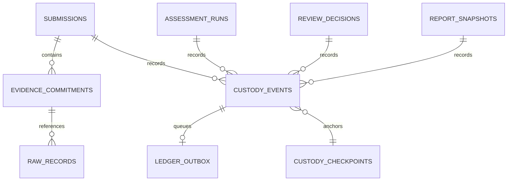

# Evidence Storage, Canonical Serialization, and Cryptographic Commitments

## 1. Architectural Role and Scope Boundaries

The Supervisory Analytics Tool for SOC Assessment (**SAT-SA**) is designed for periodic supervisory assessments conducted by **NTRO / NCIIPC**. It is strictly a supervisory assessment workbench and is **not** a real-time SIEM, autonomous control authority, or continuous telemetry collector.

In accordance with Section 3 and Section 4 of the architectural requirements baseline:
1. **SQL Database as the System of Record**: All entity configurations, submissions, raw/normalized records, assessment findings, review decisions, and cryptographic audit events are stored in the local SQL database (SQLite with SQLAlchemy, with documented scale-up path to PostgreSQL).
2. **Preservation of Original Evidence**: Original submitted bytes are stored immutably in the local evidence store (`storage/evidence/`). Original files are never overwritten, modified, or redacted.
3. **Rigorous Separation of Exact Integrity from Approximate Similarity**: Approximate representations (TLSH fuzzy digests, MiniLM cosine embeddings) are never conflated with or substituted for exact cryptographic proofs.

---

## 2. Integrity Representation Hierarchy

To prevent ambiguity, SAT-SA establishes four explicitly decoupled layers of data representation:

| Layer | Representation / Primitive | Purpose | Mutability |
| :--- | :--- | :--- | :--- |
| **Raw File** | Exact-byte SHA-256 hex digest | Proves exact submitted file stream has not been altered bitwise. | Immutable original bytes |
| **Canonical Record** | Deterministic JSON (`v1.0-canonical-json`) + 128-bit cryptographic nonce | Proves structured fields, scope, and provenance have not been modified. | Canonical envelope digest |
| **Batch Tree** | RFC 6962 Domain-Separated Merkle Tree | Provides cryptographically auditable inclusion proofs for batches. | Immutable root per submission |
| **Similarity Layer** | 3-gram Word Jaccard, TLSH fuzzy digest, MiniLM dense vector | Approximate investigation text comparison and candidate retrieval. | Derived analytic observation |

> [!IMPORTANT]
> A fuzzy hash or dense embedding is **never** used as a cryptographic proof. Conversely, a formatting-normalized canonical record digest does **not** claim to prove original file byte equivalence. Both are maintained as separate fields.

---

## 3. Canonical Record Serialization Specification (`v1.0-canonical-json`)

Structured commitments are bound to their entity scope, record identity, representation version, and evidence content to prevent cross-entity replay and spoofing.

### 3.1 Serialization Invariants
1. **Key Ordering**: All dictionary keys are recursively sorted alphabetically using Unicode code points.
2. **Unicode Normalization**: All string keys and string values are normalized using Unicode Normalization Form C (**NFC**). Decomposed code points (e.g. `e` + combining acute accent) are canonically unified with precomposed forms (`é`).
3. **Null and Boolean Preservation**:
   - `null` is explicitly rendered as JSON `null` (never converted to empty strings or dropped).
   - `true` and `false` are explicitly rendered as JSON lowercase boolean primitives.
4. **Number Representation**:
   - Integers are rendered without leading zeros.
   - Floats are deterministically formatted to 8 decimal places with trailing zeros stripped; whole floats normalize to integer representation. Non-finite values (`NaN`, `Infinity`, `-Infinity`) are strictly rejected.
5. **Array Determinism**: Array and list order is strictly preserved, maintaining domain-meaningful sequence.
6. **Compact Delimiters**: JSON formatting uses `separators=(',', ':')` without extraneous whitespace.

### 3.2 Canonical Record Commitment Envelope
Each record is encapsulated in a deterministic envelope before hashing:
```json
{
  "canonical_content": {
    "disposition": "benign",
    "status": "closed",
    "threat_level": 1
  },
  "entity_id": "E-101",
  "native_id": "INC-2026-00892",
  "nonce": "a7f3e1b2c4d5e6f7a8b9c0d1e2f3a4b5",
  "record_type": "case",
  "representation_version": "v1.0-canonical-json",
  "submission_id": "sub_49a0b1c2"
}
```
The commitment is:
$$\text{Commitment} = \text{SHA256}(\text{CanonicalJSON}(\text{Envelope}))$$

---

## 4. Batch Merkle Tree Construction (RFC 6962 Domain Separation)

For batches of evidence records committed in a submission, SAT-SA builds a deterministic Merkle tree conforming to **RFC 6962**:
- **Domain Separation Prefixes**:
  - Leaf hash: $\text{Hash}(\text{0x00} \parallel \text{leaf\_commitment})$
  - Internal node hash: $\text{Hash}(\text{0x01} \parallel \text{left\_child} \parallel \text{right\_child})$
- **Inclusion Proofs**:
  For any record $i \in [0, N-1]$, an auditor can verify batch membership via $O(\log N)$ sibling hashes without revealing or accessing other records in the submission.

---

## 5. Database Schema and Foreign Key Integrity

The evidence integrity subsystem introduces five tables via Alembic migration `07a1b2c34d55_evidence_integrity.py`:



1. **`evidence_commitments`**: Stores exact-byte SHA-256 for original files, canonical record commitment digests, Merkle inclusion proofs, and per-record nonces.
2. **`custody_events`**: Append-only log with monotonic sequence numbers, cryptographic hash linking (`previous_event_commitment`), Ed25519 digital signatures, and claimed vs recorded timestamps.
3. **`custody_checkpoints`**: External verification anchors recording tree size, Merkle root hash, and authority signatures.
4. **`ledger_outbox`**: Transactional outbox guaranteeing atomic database commit and retryable ledger anchoring.
5. **`verification_runs`**: Records audit verification history, issues detected, and staleness status.

---

## 6. Offline Verification Invariants

The standalone verification tool (`scripts/verify_evidence.py`) validates:
1. Exact file bytes match recorded SHA-256.
2. Canonical record commitments match structured record contents and nonce.
3. Batch Merkle roots match inclusion proofs.
4. Digital signatures verify against an **independently provisioned** public key.
5. Any altered bit, missing record, out-of-order sequence, or substituted key yields an immediate nonzero exit code and explicit diagnostic error.
