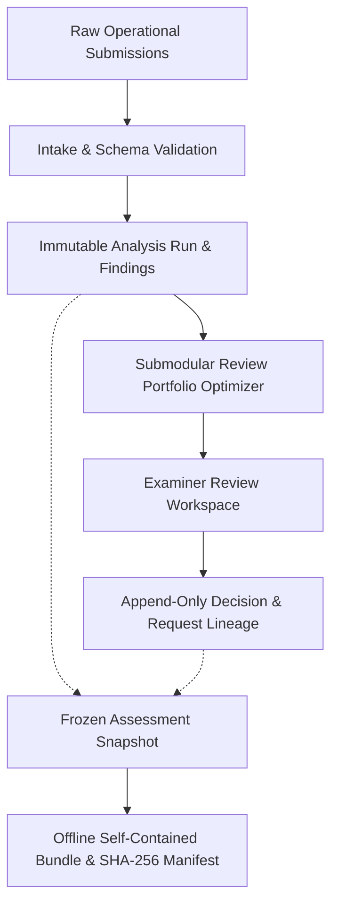
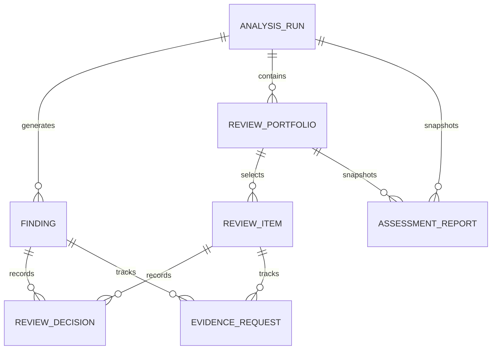
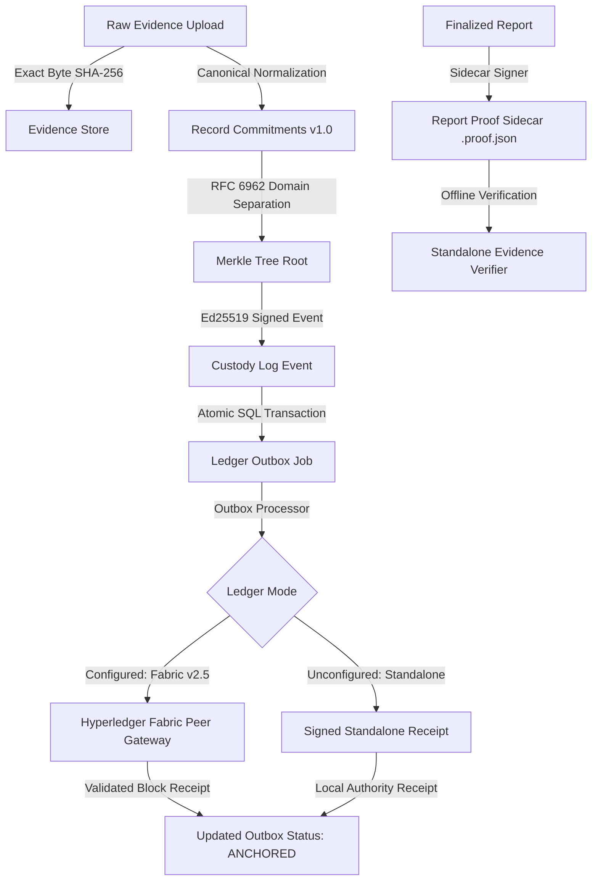

# Supervisory Assessment & Review Platform — System Architecture

## 1. Architectural Philosophy & Invariants

The platform is designed as an offline-first supervisory assessment workbench for cyber examiners. It implements five non-negotiable architectural invariants:

1. **Strict Immutability of Machine Findings**: Algorithmic rules and NLP models generate supervisory findings. Once persisted, finding records are never updated, overwritten, or deleted by human deliberations.
2. **Dedicated Human Deliberation Lineage**: Human supervisory decisions (`substantiated`, `not_substantiated`, `additional_evidence_required`, `not_applicable` for findings; `reviewed_no_concern`, `concern_observed`, `additional_evidence_required` for portfolio items) are stored in dedicated audit tables with optimistic concurrency tracking (`version`, `superseded_decision_id`).
3. **No Autonomous Pass/Fail Verdicts**: Machine outputs are explicitly presented as hypotheses with uncertainty bounds and alternative explanations (e.g., outsourced MSSP handling, scanner cadence, missing telemetry). Human examiners retain exclusive supervisory decision authority.
4. **Submodular Knapsack Portfolio Selection**: Examiners operate under strict time budgets. Rather than naively sorting by risk scores, the engine optimizes a submodular objective function across three distinct strata (`targeted`, `control`, `exploratory`), maximizing marginal hypothesis coverage ($\Delta H$) while enforcing group diversity caps.
5. **Frozen Assessment Snapshots & Cryptographic Verification**: Assessment exports snapshot database state up to an exact UTC cutoff timestamp. The resulting release bundle (self-contained HTML, raw JSON, and SHA-256 manifest) can be verified and rendered completely offline without network access.

---

## 2. Component Architecture

### 2.1 Backend Core (`apps/api` & `packages/`)
- **Framework**: FastAPI with Pydantic v2 schemas and SQLAlchemy 2.0 ORM.
- **Database**: SQLite (local development / single-node) or PostgreSQL (offline container deployment).
- **Authentication**: Stateful session cookies with `HttpOnly`, `SameSite=Lax`, and double-submit CSRF tokens. Role-based and entity-scoped access control (`examiner`, `lead_examiner`, `admin`).
- **Analytics Engine (`packages/analytics`)**:
  - Rule evaluation against operational telemetry (KPIs, escalation delays, coverage gaps, investigation depth).
  - Semantic claim reconciliation using pre-downloaded sentence transformer weights or deterministic lexical fallback when offline model is unavailable.
- **Reporting Engine (`packages/reporting`)**:
  - `snapshot.py`: Queries frozen state across runs, findings, portfolios, decisions, and evidence requests.
  - `render.py`: Formats frozen snapshot into self-contained HTML with strict character escaping against stored XSS vulnerabilities.
  - `manifest.py`: Computes cryptographic SHA-256 digests over all generated export artifacts.

### 2.2 Frontend Application (`apps/web`)
- **Framework**: React 18 + TypeScript + Vite.
- **Styling**: Vanilla CSS design system with CSS custom properties, glassmorphism panels, dark mode, and responsive flex/grid layouts.
- **Offline Guarantee**: Zero external dependencies at runtime. No CDNs, no Google Fonts, no telemetry pings. All fonts and assets are embedded locally.
- **Feature Modules**:
  - `features/findings`: Detailed finding inspection with telemetry provenance, rule metadata, and alternative hypotheses.
  - `features/review`: Submodular review queue, portfolio configuration, decision forms, and local evidence request management.
  - `features/reports`: Report generation modal, frozen report list, and iframe-isolated print/export preview drawer.

---

## 3. Data Model & Schema Relationships

- **`AnalysisRun`**: Represents an executed batch analysis for an entity and submission period.
- **`Finding`**: An immutable machine-generated finding capturing rule ID, severity, confidence, evidence IDs, and alternative explanations.
- **`ReviewPortfolio`**: A budgeted selection of candidate units generated via submodular knapsack optimization.
- **`ReviewItem`**: An individual unit in a portfolio belonging to a stratum (`targeted`, `control`, `exploratory`) with marginal selection reasons and what the examiner learns.
- **`ReviewDecision`**: An append-only audit record of an examiner's judgment with optimistic concurrency versioning.
- **`EvidenceRequest`**: A local audit record tracking outstanding documentation requests without external transmission.
- **`AssessmentReport`**: An immutable snapshot storing rendered HTML, raw JSON, and SHA-256 checksum manifest.

---

## 4. Offline Deployment & Air-Gapped Operation

The platform is designed to run in air-gapped environments without egress network access.

1. **Loopback Binding**: Services bind strictly to `127.0.0.1` (`0.0.0.0` in containerized loopback bridge).
2. **Offline Release Bundle**:
   - Packaged as `sat_sa_offline_bundle.zip`.
   - Contains pre-built static web assets, application source code, offline Python wheels, pre-downloaded ML weights, and database migrations.
3. **Verification**: `scripts/verify_release.py` recalculates digests across all files and verifies the model manifest prior to bootstrap.

---

## 5. Cryptographic Evidence Architecture & Verifiable Custody (Prompt 1)

### 5.1 Five-Tier Integrity Separation

1. **Exact Raw-File SHA-256**: Computed strictly over submitted file bytes prior to parsing or normalization. Preserved verbatim in local proof store.
2. **Canonical Record Commitment**: Deterministic, versioned canonical JSON serialization (`v1.0-canonical-json`) enforcing RFC 8785 key sorting, NFC Unicode normalization, exponential-free floating point representation, and explicit record nonces.
3. **Domain-Separated Merkle Trees (RFC 6962)**: Domain prefix `0x00` for leaf nodes and `0x01` for internal branches. Audit paths verifiable against exact leaf index and tree size.
4. **Fuzzy Hashing Digest (TLSH)**: 70-character locality sensitive hash (`T1` prefix) for near-duplicate investigation passage matching only. Never used as a cryptographic proof.
5. **Semantic Embedding (MiniLM)**: 384-dimensional dense vectors for conceptual similarity and paraphrase discovery.

### 5.2 Transactional Outbox Pattern

To prevent distributed two-phase commit failures between the SQL database and the blockchain gateway:
- **Atomic SQL Commit**: Whenever a supervisory milestone is recorded (`submission_committed`, `evidence_revision_registered`, `assessment_finalized`, `human_decision_recorded`, `report_snapshot_finalized`), both the `CustodyEvent` and a corresponding `LedgerOutbox` record are committed atomically in SQLite.
- **Idempotency**: Every outbox entry carries a deterministic idempotency key (`idempotency_key = sha256(entity_id:event_type:sequence_number)`).
- **Outbox Worker**: Processes pending entries with exponential backoff and maximum retry thresholds. Records transaction IDs, block numbers, channel, and endorsing peers upon validation.
- **Outage Tolerance**: If the ledger is offline or unconfigured, the application analytical workflow continues with an explicit status (`pending_anchor` or `standalone_signed_log`). It never blocks examination or manufactures fake blockchain badges.

### 5.3 Standalone Proof Sidecars & Verifier

- Assessment reports (`.html`, `.json`) are finalized first.
- A cryptographic digest of the immutable report is signed by the service signing authority and exported as a standalone proof sidecar (`.proof.json`).
- Reports and sidecars can be verified completely offline using `scripts/verify_evidence.py` or `packages.evidence_integrity.verifier.StandaloneEvidenceVerifier` without requiring database access or network connectivity.
